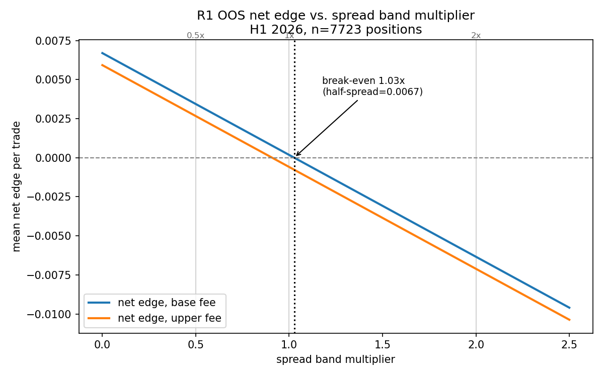
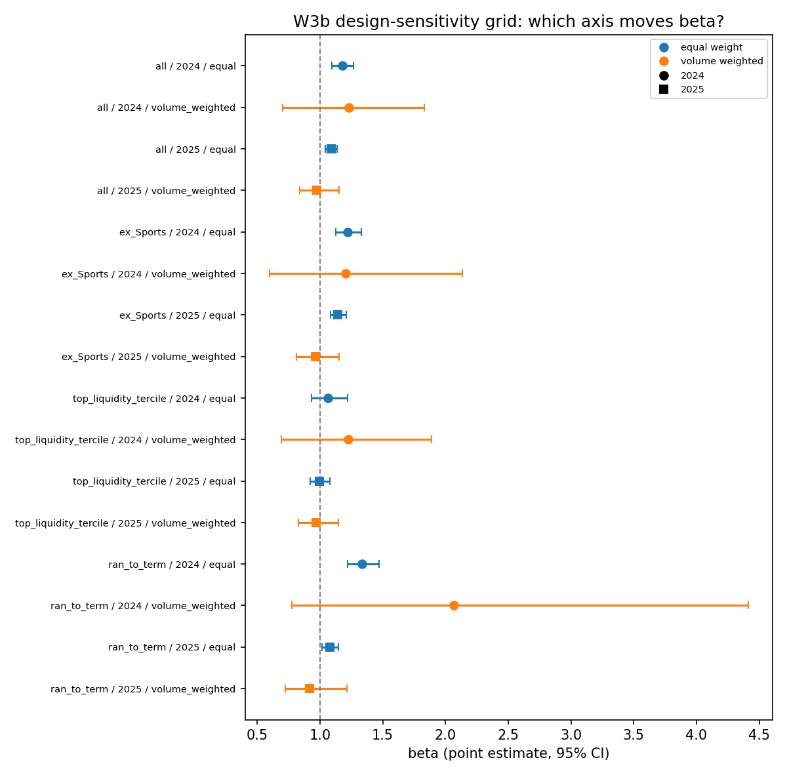

# pm-calibration

Polymarket prices are systematically compressed toward 50%: longshots trade too high, favorites too low. The effect is real, it survives inference that respects dependence between markets, and it persists out-of-sample into a period no published paper covers. It is also almost exactly the size of what it costs to trade it.

That last sentence is the result. Break-even sits at 1.03x the observed spread. The mispricing and the cost of capturing it are the same size, to within three percent.

## The question, and why it needed re-asking

Prediction market calibration drew a lot of attention in 2025 and 2026, and several papers working from the same Polymarket and Kalshi data reached opposite conclusions on whether the classic favorite-longshot bias is there at all. Reading them side by side, the disagreement traces to design choices rather than to the data: whether inference runs at the trade level or the market level, which clock "distance from resolution" is measured against, and how markets that resolve long before their scheduled end date get handled. Most markets do resolve early, as it turns out, which makes that third choice load-bearing in a way none of the papers discuss.

So this project fixes the design, states it in advance, and runs the question end to end. Market-level panel with bootstrap clustered by event, because thousands of trades sharing one realized outcome are not thousands of independent observations. Snapshot timing anchored to actual resolution rather than scheduled end. And the whole of H1 2026 sealed in code until the final stage, so the out-of-sample test lands on data none of the published work has seen.

## What it found

**In-sample, January 2024 through December 2025.** 52,310 market-snapshot observations across roughly 7,500 independent events. The calibration slope beta comes from a logistic fit of realized outcomes on logit-transformed prices: beta = 1 is perfect calibration, beta > 1 is compression toward 50%.


| Cell | n | β | 95% CI |
|---|---|---|---|
| **Pooled (ex-Sports)** | 33,517 | **1.165** | **[1.116, 1.224]** |
| Econ/Finance | 4,729 | 1.353 | [1.242, 1.485] |
| Geopolitics | 3,997 | 1.309 | [1.178, 1.463] |
| Other | 1,708 | 1.172 | [0.982, 1.431] |
| Politics | 13,750 | 1.146 | [1.063, 1.241] |
| Culture | 5,237 | 1.098 | [0.981, 1.230] |
| Crypto | 4,096 | 1.095 | [0.993, 1.220] |
| Sports | 18,793 | 0.999 | [0.936, 1.068] |

Sports is the clean exception: beta = 0.999 with a tight interval. Deep liquidity, fixed resolution dates, no compression.

**Out-of-sample, January through June 2026.** The rule was frozen first, in its own commit, before anything read a 2026 row: buy against longshots priced 2 to 10 cents, buy favorites priced 90 to 98, hold to resolution. 7,723 positions after censoring.

Gross edge is +0.0124 per trade, 95% CI [+0.0062, +0.0178], excluding zero. Then costs land on it.



At half the observed spread the strategy makes 34 basis points a trade. At the observed spread it makes two. At twice it loses. Six months and 7,723 positions end at +1.36 units of cumulative profit against a maximum drawdown of 23.44. Risk 23 to make 1.4.

Calibration itself held up better than the strategy. Beta moved from 1.165 to 1.077, and the out-of-sample interval [1.027, 1.133] still excludes 1.0. The mispricing is still there in 2026, somewhat attenuated. What is not there is a way to get paid for it.

Read together, that is a limits-to-arbitrage result rather than an inconclusive one. The market prices its own frictions almost exactly at the size of its own mispricing.

## A second finding, from the reconciliation stage

Before the out-of-sample test, the project re-estimated everything across weighting scheme, sample definition, and period, to see which design choices actually move the answer. Two came back worth reporting.

Choice of clock barely matters. Ex-ante horizon and the literature's ex-post horizon overlap in 21 of 21 category-tercile cells, on both the full sample and a restricted one. There was no clock-driven divergence to reconcile.

Volume weighting matters enormously, but not in the direction anyone would expect. It barely shifts the point estimate. What it does is destroy precision. Kish's effective sample size collapses by factors between 10 and 133 across cells: one 6,135-row cell drops to an effective 46 observations. Every equal-versus-weighted pair widens the confidence interval, none narrows it, and Polymarket volume is skewed enough that a handful of large markets dominate the weighted likelihood.

That has a consequence beyond this project. A trade-level analysis implicitly volume-weights, since a market with a thousand trades enters a thousand times. So a nominal N in the hundreds of millions of trades can carry an effective sample size orders of magnitude smaller. The usual objection to market-level inference is that it throws away observations. On this data the trade-weighted design has less effective information, not more.



## Pre-registration

The primary specification was committed before any calibration statistic ran on the full sample, and the frozen trading rule before any 2026 row was readable. Both commit hashes are in the history. That is the whole point: a spec written afterward can drift toward whatever looks better, and no amount of stated good intentions substitutes for a timestamp.

- **Population:** binary markets resolved 2024-01-01 to 2026-06-30, volume ≥ $10,000, scheduled lifetime ≥ 168 hours.
- **Panel:** monthly snapshots, one row per open market per snapshot, price from the last point within 72 hours.
- **Inference:** market-level, block bootstrap resampled by event, B = 2,000. Single engine, every confidence interval in the project comes from it.
- **Primary estimand:** logit(P(Y=1)) = α + β·logit(p) against α = 0, β = 1. Pooled ex-Sports is primary, everything else is labeled secondary in the output itself.
- **Out-of-sample:** fit through 2025-12-31, evaluate H1 2026. Enforced in `src/panel/io.py`, unlocked in a standalone commit.
- **Costs:** per-category fee schedule verified against Polymarket's own worked-example table, spread from live order books with sensitivity bands, capital cost from lockup duration against the 3-month Treasury.

## What this does not establish

Stated because the honest scope of a result is part of the result.

One frozen rule with fixed thresholds, not a search over rules. A different entry band or a liquidity filter might behave differently, untested here by design, since testing them would have needed the tuning freedom the pre-registration deliberately gave up.

The spread assumption is contemporary order books applied retroactively. A rank-ordering check against historical daily bars supports it modestly (Spearman +0.391), not strongly. Break-even at 1.03x sits close enough to the assumed band that a materially different true spread flips the sign. That is exactly why break-even is the headline number rather than the net edge itself.

Six months, one venue, one fee regime.

## The pipeline underneath

| | |
|---|---|
| Resolved markets ingested | 331,035 |
| Distinct events | 203,087 |
| Panel-eligible markets (scheduled life ≥ 168h) | 94,442 |
| Price history coverage | 98.86% |
| Panel rows (monthly snapshots, Jan 2024 to Jun 2026) | 95,899 |
| Tests | 259 |

Everything is built from two public Polymarket read endpoints. No API key, no wallet, no purchased dataset.

Getting there was messier than that table suggests, and [DECISIONS.md](DECISIONS.md) logs every deviation with the date, the number that forced it, and what changed. A few that mattered:

Offset pagination silently caps out around 2,000 rows per window, and the API returns page one again, with a 200, if you guess the cursor parameter name wrong. Both have guards now.

The population turned out to be 46% crypto micro-markets on 24-hour cycles. A 168-hour minimum lifetime filter removes them by construction, which also resolved a sample-composition problem that was not visible going in.

Between 21% and 40% of markets in every category resolve more than two days early. That is why market openness at a snapshot is computed against actual resolution and never against the scheduled date. Using the scheduled date would have kept resolved markets phantom-open in the panel.

Row count is not a usable proxy for statistical power here. Sports has the most rows of any category by a wide margin and still nearly fails a 200-cluster floor when split by horizon, because a few long-lived markets generate many repeated snapshot rows each. Cluster counts are reported in every stratified output now rather than assumed.

Polymarket's fee documentation and its deployed contract disagree on the fee formula, and they diverge most at exactly the prices this strategy trades. Checking the documented formula against Polymarket's own published fee table across five price points settled it to the cent.

## Repo layout

```
config/spec.yaml      snapshot dates, filters, OOS boundary, the pre-registered numbers
src/ingest/           Gamma and CLOB clients, DNS handling, caching, retry and gap logging
src/panel/            resolution parsing, category mapping, panel construction, the OOS loader
src/inference/        event-clustered bootstrap, the single source of every CI in the project
src/calibration/      reliability, Murphy decomposition, calibration regression, clocks, grid
src/strategy/         cost model, R1 mechanics, evaluation
spikes/               gate reports A through F, each one a checkpoint that had to pass
reports/figures/      generated figures
tests/                259 tests, mostly edge cases the real data actually produced
DECISIONS.md          dated log of every design decision and reversal
```

Isotonic regression, the IRLS logistic fit, Benjamini-Hochberg, and the Roll estimator are written out rather than imported, each benchmarked against an established implementation and pinned to hardcoded golden values in the tests. scipy handles the exact binomial test, where hand-rolling the CDF work is not worth the precision risk.

## Running it

```
python3 -m venv .venv && source .venv/bin/activate
pip install -r requirements.txt
pytest tests/ -q
```

Rebuilding the panel from scratch re-pulls 331k markets and 94k price histories, roughly twelve hours against the public API. Raw responses are not committed (`data/` is gitignored) but every ingestion script is resumable and skips whatever it already has.

---

Built by Angelo Marano, incoming MSc Statistics at ETH Zurich. Claude Code was used as a coding assistant throughout; design decisions and their rationale are logged in [DECISIONS.md](DECISIONS.md).
