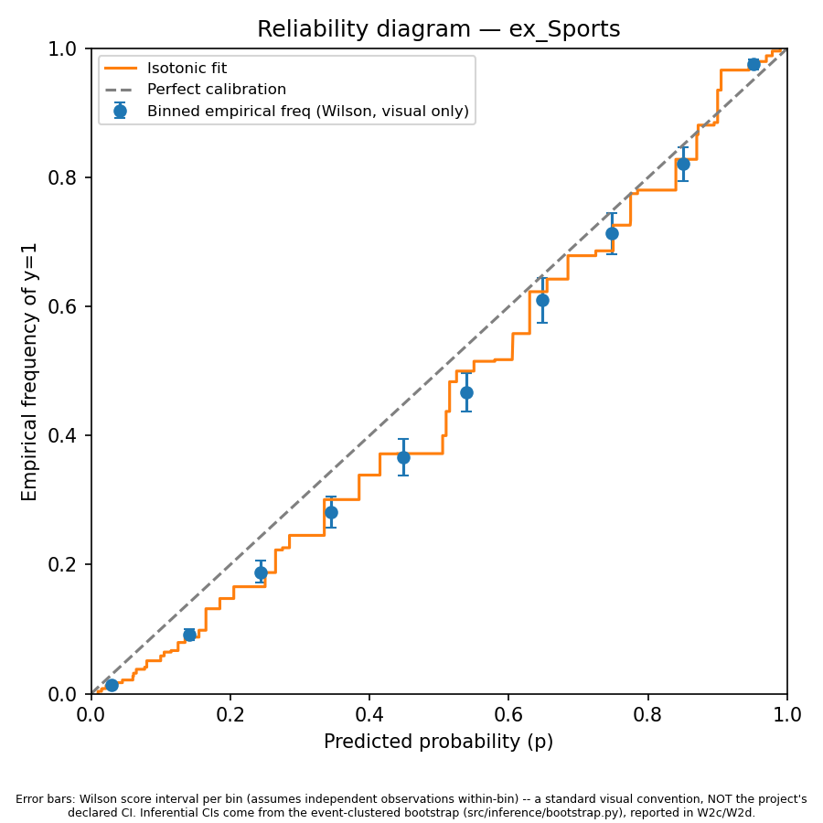

# pm-calibration

Are Polymarket prices well-calibrated probabilities? And where they're not, does the gap survive honest statistical treatment: inference that respects dependence between markets, timing a trader could actually have observed in real time, and an out-of-sample test net of trading costs?

Everything here is built from the two public Polymarket read endpoints. No API key, no wallet, no purchased dataset.

## Why this exists

Prediction market calibration got a lot of attention in 2025-2026, and several papers analyzing the same Polymarket and Kalshi data reached opposite conclusions on whether the classic favorite-longshot bias is there. The disagreement traces back to design choices each paper made differently: inference at the trade level or the market level, which clock "distance from resolution" is measured against, and how they treat markets that resolve long before their scheduled end date (most of them do, once you check).

So this project fixes three things and re-runs the question. Inference is market-level with bootstrap clustered by event, because thousands of trades sharing one realized outcome don't give you thousands of independent observations. Snapshot timing is anchored to actual resolution rather than scheduled end date, which turned out to matter far more than expected. And the whole of H1 2026 is locked away in code until the out-of-sample stage, so the final test runs against data no published paper has seen.

## Results so far

Calibration measured on 52,310 market-snapshot observations from January 2024 through December 2025, spanning roughly 7,500 independent events.



The calibration slope β comes from a logistic fit of realized outcomes on logit-transformed prices. β = 1 means prices are calibrated. β > 1 means they're compressed toward 50%, which is the favorite-longshot signature: longshots priced too high, favorites too low.

| Cell | n | β | 95% CI |
|---|---|---|---|
| **Pooled (ex-Sports)** | 33,517 | **1.165** | **[1.116, 1.224]** |
| Econ/Finance | 4,729 | 1.353 | [1.242, 1.485] |
| Geopolitics | 3,997 | 1.309 | [1.178, 1.463] |
| Other | 1,708 | 1.172 | [0.982, 1.431] |
| Politics | 13,750 | 1.146 | [1.063, 1.241] |
| Culture | 5,237 | 1.098 | [0.981, 1.230] |
| Crypto | 4,096 | 1.095 | [0.993, 1.220] |
| Sports | 18,793 | 0.999 | [0.936, 1.068] |

Three things stand out.

**Compression is real in the pooled non-sports sample.** The confidence interval excludes 1.0 even under event-clustered inference, which is the conservative version. It holds up across most individual categories, strongest in Econ/Finance and Geopolitics.

**Sports is the exception, and it's dead on.** β = 0.999 with a tight interval. Whatever drives the compression elsewhere, high-volume sports markets with a deep liquidity base and a fixed resolution date don't have it.

**The literature's horizon pattern does not reproduce cleanly here.** Published work reports compression growing with time to resolution. In this panel, of the four categories with enough independent events to split three ways by horizon, only Geopolitics rises directionally (1.12 → 1.31 → 1.58) and even there the confidence intervals overlap. Crypto, Politics, and Sports aren't monotonic at all. That's a negative result and it's reported as one. Whether it reflects something real or an artifact of measuring horizon ex-ante rather than backwards from resolution is exactly what the next stage tests.

Prices beat the base rate everywhere. Brier skill score runs 0.29 (Sports) to 0.60 (Politics), and the Murphy decomposition is lopsided: the reliability term is near zero (0.0009 to 0.0013) while resolution carries 0.068 to 0.073. Within any given price bucket the forecasts are close to honest. What limits them is discrimination, meaning prices don't move far enough from the base rate, not miscalibration inside the buckets.

All of it is in-sample and descriptive. Whether it's signal or a design artifact is what the reconciliation grid tests next, and whether any of it is tradeable is a separate question again.

## Pipeline

| | |
|---|---|
| Resolved markets ingested | 331,035 |
| Distinct events | 203,087 |
| Panel-eligible markets (scheduled life ≥ 168h) | 94,442 |
| Price history coverage | 98.86% |
| Panel rows (monthly snapshots, Jan 2024 to Jun 2026) | 95,899 |
| Usable now, before the out-of-sample unlock | 52,388 |
| Tests | 177 |

Getting there was less tidy than that table suggests. [DECISIONS.md](DECISIONS.md) logs every deviation from the original plan with the date, the number that forced it, and what changed. Some highlights: offset pagination silently caps out around 2,000 rows per window and had to be replaced with cursor-based paging (the API also returns page 1 again, with a 200, if you guess the cursor parameter name wrong, so there's a guard for that). The population turned out to be 46% crypto micro-markets on 24-hour cycles, which a 168-hour minimum lifetime filter removes from the panel by construction. Between 21% and 40% of markets in every category resolve more than two days early, which is why openness at a snapshot is computed against actual resolution and never against the scheduled date.

The most useful thing that came out of that process: row count is not a usable proxy for statistical power here. Sports has the most rows of any category by a wide margin and still nearly fails a 200-cluster floor when split by horizon, because a handful of long-lived markets generate many repeated snapshot rows each. Cluster counts are now reported in every stratified output rather than assumed.

## Primary specification

Committed before any calibration statistic was computed on the full sample, which is the whole point. A pre-registered spec means the results can't quietly drift toward whatever looks better afterward.

- **Population:** binary markets resolved between 2024-01-01 and 2026-06-30, volume ≥ $10,000, scheduled lifetime ≥ 168 hours.
- **Panel:** monthly snapshots (1st of month, UTC), one row per open market per snapshot, price taken from the last point within 72 hours.
- **Inference unit:** market, not trade. Block bootstrap resampled by event, B = 2,000.
- **Primary estimand:** logit(P(Y=1)) = α + β·logit(p), tested against α = 0, β = 1. The pooled ex-Sports cell is the primary result; every other cell is labeled secondary in the output itself.
- **Out-of-sample:** fit through 2025-12-31, evaluate January to June 2026. Enforced in code (`src/panel/io.py`), not by good intentions.
- **Costs:** per-market fee flags, spread from historical order books, capital cost from lockup duration against the risk-free rate.

## Repo layout

```
config/spec.yaml      snapshot dates, filters, OOS boundary, the pre-registered numbers
src/ingest/           Gamma and CLOB clients, DNS handling, caching, retry and gap logging
src/panel/            resolution parsing, category mapping, panel construction, the OOS loader
src/inference/        event-clustered bootstrap, the single source of every CI in the project
src/calibration/      reliability diagrams, Murphy decomposition, the calibration regression
spikes/               feasibility and sanity reports (Gates A through D)
reports/figures/      generated reliability diagrams
tests/                177 tests, mostly edge cases the real data actually produced
DECISIONS.md          dated log of every design decision and reversal
```

Isotonic regression, the IRLS logistic fit, and the Benjamini-Hochberg correction are written out rather than imported, each benchmarked against an established implementation and pinned to hardcoded golden values in the tests. scipy handles the exact binomial test, where hand-rolling the CDF work isn't worth the precision risk.

## Running it

```
python3 -m venv .venv && source .venv/bin/activate
pip install -r requirements.txt
pytest tests/ -q
```

Rebuilding the panel from scratch re-pulls 331k markets and 94k price histories, roughly twelve hours against the public API. Raw responses aren't committed (`data/` is gitignored) but every ingestion script is resumable and skips whatever it already has.

## What's next

The reconciliation grid: re-estimate across weighting scheme, time reference, sample definition, and period, to show which design choices flip the published result and which don't. Then the out-of-sample test on H1 2026, net of fees, spread, and the cost of capital locked up until resolution.

---

Built by Angelo Marano, incoming MSc Statistics at ETH Zurich.
